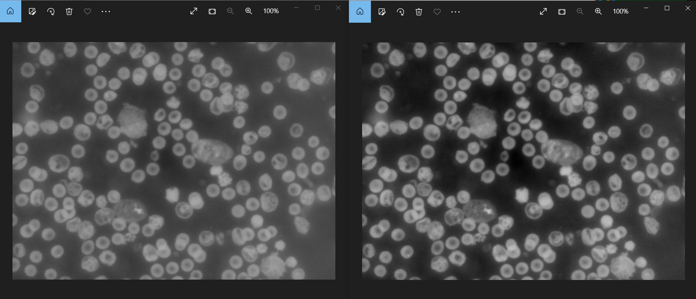

# Level 3 实验报告

姓名：蓝俊玮 学号：PB20111689

实验环境：Windows 10 Python 3.9.0 Pycharm Community Edition 2021

## 1. 实验选题

Level 3.9 生物显微镜/天文望远镜的图像往往用于记录描述不同物质/细胞/病毒，这些目标物质/细胞/病毒一般会具有显著区别于周边区域的亮度（亮斑），若同一标本的某个通道灰度图像在某一位置/区域出现了显著区别于周边区域的亮度，则需要对其进行标记并计数，请给出该通道图像的这些亮斑。

> 提示 1：计算出灰度图像的基本底色亮度，找到灰度图像中显著亮于该背景灰度的所有像素，对这些像素，相邻像素做聚合，则得到亮斑，对其计算即可。
>
> 提示 2：高像素图像可考虑切割成多个边缘略有重叠的区块后，用多进程/多线程实现。

## 2. 实验思路

采取提示 1 的方案，首先进行灰度反转，获取所有像素的底色，然后计算出灰度图像的基本底色亮度（平均底色亮度），然后根据平均底色亮度来聚合像素，以此确认哪处为亮斑（即细胞），便可以进行细胞计数。

### 2.1 灰度反转

对每个像素点进行灰度转换，即将其黑白颠倒，并且在此过程中记录下像素最大亮度值以及最小亮度值，用于后面的灰度转换图像增强。

```python
	img = Image.open("cell_image.png")  # 打开图像
    newImg = img.convert("L")  # 转换图像模式，L 表示灰度图像（黑白）
    width, height = newImg.size   # 得到图片的宽度以及高度
    pixel_min = 255
    pixel_max = 0
    for i in range(height):
        for j in range(width):
            newImg.putpixel((j, i), 255 - newImg.getpixel((j, i)))  # 黑白颠倒
            pixel_min = min(pixel_min, newImg.getpixel((j, i)))
            pixel_max = max(pixel_max, newImg.getpixel((j, i)))
```

### 2.2 灰度转换图像增强

由于图像的颜色区分可能不是很明显，所以可以实现一次图像增强，这里采用简单的归一化，K 是尺度因子，增强对比度，可以使暗的更暗，亮的更亮，可以改变 K 因子的大小来获取不同的效果：

$s = K\times\frac{i-p_{min}}{p_{max}-p_{min}}$

```python
	table = []
    for i in range(256):
        table.append(200*(i-pixel_min)/(pixel_max-pixel_min))
	newImg = newImg.point(table, 'L')
```

可以看到效果如下，其中左边为正常的灰度转换，右边为归一化后的灰度转换：



### 2.3 计算基本底色亮度

这里通过 $基本底色亮度=\frac{所有像素亮度之和}{像素数量}$ 来计算基本底色亮度。

```python
	brightness = 0
    for i in range(height):
        for j in range(width):
            brightness += newImg.getpixel((j, i))
    brightness /= (width * height)  # 此时 brightness 是平均的亮度
```

### 2.4 根据基本底色确认亮斑

将每一个像素点的亮度和基本底色亮度作比较，取一个数值（例如此处为 20 ）作为比较数值，以此确认亮斑，即定义比基本底色亮度高 20 的像素点为亮斑，并在确认为亮斑后将此像素的亮色提到最高，便于区分。**对于不同细胞图像，需要选择不同的数值来提高计数的准确性。**

```python
    for i in range(height):
        for j in range(width):
            if newImg.getpixel((j, i)) > brightness + 20:
                flag[i][j] = True
                newImg.putpixel((j, i), 255)
```

### 2.5 亮斑聚合以及细胞计数

采用的思路是搜寻一个点的极大连通图，通过 BFS 的搜索策略，对一个点的周围进行搜索，将周围所有亮斑像素聚合起来成为一个亮斑来计数。

```python
def bfs(x, y):
    queue.append((x, y))
    while len(queue) != 0:
        (xx, yy) = queue.pop()
        flag[xx][yy] = False
        for k in range(4):
            new_x = xx + dx[k]
            new_y = yy + dy[k]
            if 0 <= new_x < height and 0 <= new_y < width and flag[new_x][new_y]:
                queue.append((new_x, new_y))
```

对所有像素位置开始计数，当其为亮斑像素时，就对其周围所有的亮斑像素进行聚合，通过 BFS 方法聚合后的亮斑像素，其标记会置为 `False` ，防止重复计数。

```python
    for i in range(height):
        for j in range(width):
            if flag[i][j]:  # 如果是亮斑，就对其bfs，遍历其所在的连通图
                bfs(i, j)
                cell_cnt += 1   # 细胞数加 1
```

## 3. 实验代码

```python
from PIL import Image


def bfs(x, y):
    queue.append((x, y))
    while len(queue) != 0:
        (xx, yy) = queue.pop()
        flag[xx][yy] = False
        for k in range(4):
            new_x = xx + dx[k]
            new_y = yy + dy[k]
            if 0 <= new_x < height and 0 <= new_y < width and flag[new_x][new_y]:
                queue.append((new_x, new_y))


if __name__ == '__main__':
    cell_cnt = 0  # 细胞数目
    queue = []     # bfs 队列
    dx = [-1, 0, 1, 0]  # 坐标转移数组
    dy = [0, 1, 0, -1]
    flag = []   # 亮斑的标记
    img = Image.open("cell_image.png")  # 打开图像
    newImg = img.convert("L")  # 转换图像模式，L 表示灰度图像（黑白）
    width, height = newImg.size   # 得到图片的宽度以及高度
    for i in range(height):
        flag.append([])
        for j in range(width):
            flag[i].append(False)   # 亮斑像素标记初始化

    pixel_min = 255
    pixel_max = 0
    for i in range(height):
        for j in range(width):
            newImg.putpixel((j, i), 255 - newImg.getpixel((j, i)))  # 黑白颠倒
            pixel_min = min(pixel_min, newImg.getpixel((j, i)))
            pixel_max = max(pixel_max, newImg.getpixel((j, i)))
    newImg.show()   # 显示初始灰度转换图像

    table = []
    for i in range(256):
        table.append(200*(i-pixel_min)/(pixel_max-pixel_min))   # 灰度增强归一化
    newImg = newImg.point(table, 'L')   # 灰度转换
    newImg.show()   # 显示灰度增强的图像

    brightness = 0  # 计算基本底色亮度
    for i in range(height):
        for j in range(width):
            brightness += newImg.getpixel((j, i))
    brightness /= (width * height)  # 此时 brightness 是平均的亮度

    for i in range(height):
        for j in range(width):
            if newImg.getpixel((j, i)) > brightness + 20:   # 根据基本底色亮度确认亮斑
                flag[i][j] = True
                newImg.putpixel((j, i), 255)

    for i in range(height):
        for j in range(width):
            if flag[i][j]:  # 如果是亮斑，就对其bfs，遍历其所在的连通图
                bfs(i, j)   # 聚合亮斑
                cell_cnt += 1   # 细胞数加 1

    newImg.save("gray.jpg")
    newImg.show()
    print("细胞数为：", cell_cnt)

```

## 4. 实验测试

在终端输入即可运行：

```bash
pip install -r requirements.txt
python level3.py
```

采用这个细胞图像进行测试：


得到转换效果为


得到最后处理出来的图片为**（可以通过这个图像来确认前面选择的亮度比较数值是否合理，以此改变数值）**：


最后程序计数的结果为：


由我手数的细胞数大概为 177 个，误差为 $\frac{177-157}{157} = 12.7\%$，原因在于多个细胞重合在一起，计算机会将其视为一个细胞进行计数，难以分辨计算，因此会导致细胞计数偏小，而这个技术偏小从生物学角度也是合理的，可以通过机器学习的方法选择合适的亮度比较数值，来降低这个误差。


